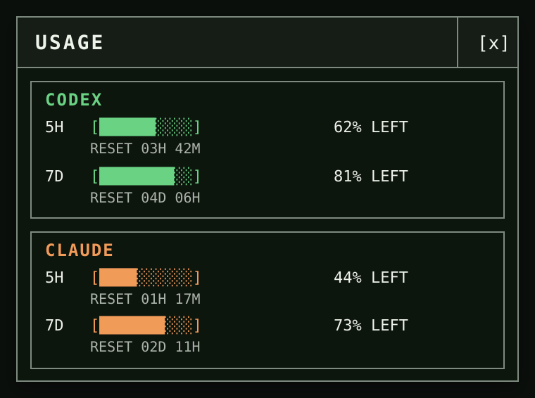

<div align="center">
  
  <h1>Usage Widget</h1>
  <p>A tiny Windows desktop panel for the exact Claude Code and Codex limits observed on your machine.</p>
  
  <p><sub>Preview uses sample values.</sub></p>
</div>

Usage Widget is a portable Windows 11 x64 app. It shows rounded percentage remaining
and reset countdowns for available five-hour and seven-day subscription-limit windows.
It does not show API billing or spend.

## Install in 30 seconds

1. Download **[usage-widget.exe](https://github.com/HashimMNYC/Usage-Tracker-Widget/releases/latest/download/usage-widget.exe)** from the latest release.
2. Keep the EXE anywhere convenient and double-click it.
3. Look for the Usage Widget icon in the notification area to reopen or quit it.

There is no installer. Windows 11 supplies the required Evergreen Microsoft Edge
WebView2 Runtime. The first release is unsigned, so Windows may show an
unrecognized-app or SmartScreen warning. A local checksum match does not establish
code-signing identity or SmartScreen reputation.

<details>
<summary>Optional: verify the download before running it</summary>

Download [usage-widget.exe.sha256](https://github.com/HashimMNYC/Usage-Tracker-Widget/releases/latest/download/usage-widget.exe.sha256) beside the EXE, open PowerShell in that folder, and run:

```powershell
$expected = (((Get-Content .\usage-widget.exe.sha256 -Raw) -split '\s+')[0]).ToLowerInvariant()
$actual = (Get-FileHash .\usage-widget.exe -Algorithm SHA256).Hash.ToLowerInvariant()
if ($actual -ne $expected) { throw 'usage-widget.exe checksum mismatch' }
```

No output means the hashes match. If SmartScreen still appears, select **More info**,
confirm the app name, and choose **Run anyway** only if you trust the download.

</details>

## What you get

- A compact, frameless panel with terminal-style ten-cell meters.
- Exact locally observed five-hour and seven-day limits, never token-based estimates.
- Reset countdowns that update without repeatedly rescanning your history.
- A notification-area tray menu for refresh, visibility, preferences, and quit.
- Optional Claude Code status-line tracking, enabled only when you choose it.
- Optional per-user launch at sign-in, disabled by default.
- No account, cloud sync, history, charts, telemetry, or automatic updates.

## Using the widget

The first launch opens the panel. Launching the EXE again shows and focuses the
existing widget. The panel can be moved by dragging its surface. `[x]` and Escape
hide it without exiting.

Use the tray menu to:

- **Show/Hide** the panel (a left-click on the tray icon also shows it).
- **Refresh** local Codex data immediately.
- Toggle **Always on Top**, enabled by default.
- Opt into **Launch at Sign-in**.
- Enable, disable, or repair **Claude Tracking**.
- **Quit** collection and remove the tray icon.

## Where the numbers come from

### Codex

The app reads local rollout JSONL files from `%CODEX_HOME%\sessions` and
`%CODEX_HOME%\archived_sessions`. If `CODEX_HOME` is unset, it uses
`%USERPROFILE%\.codex\sessions` and `%USERPROFILE%\.codex\archived_sessions`.

Only current records identified as the general `codex` limit are used. Named
model-specific limits are not substituted for the general account limit. Legacy
records without a limit identifier are accepted only when both exact windows are
present. A missing, malformed, ambiguous, or expired window stays hidden.

### Claude Code

Claude tracking is opt-in. When enabled, Claude Code sends a local status-line
payload to `usage-widget.exe claude-capture`; the widget reads only the named
five-hour and seven-day percentages and reset timestamps. It does not read Claude
credentials or transcripts. Claude remains hidden until a later valid payload
contains both exact windows.

The settings file is `%CLAUDE_CONFIG_DIR%\settings.json`, or
`%USERPROFILE%\.claude\settings.json` when `CLAUDE_CONFIG_DIR` is unset. If an
existing status line would conflict, setup leaves the file unchanged for manual
review.

For every valid window, remaining is calculated as
`round(clamp(100 - used percent, 0, 100))`. Data is only as fresh as the latest
valid local CLI record or status-line payload. If neither provider has current
data, the panel displays `NO CURRENT LIMIT DATA`.

## Local-only by design

The release app makes no provider API or other application-originated network
calls and has no HTTP listener. It includes no OAuth, cookie access, API-key
discovery, telemetry, analytics, updater, or remote asset.

App-owned state contains only normalized limits, window position, preferences, and
the identities needed to manage the two optional integrations. It never stores or
displays prompts, transcripts, credentials, account identifiers, raw provider
records, or provider source paths.

See [Privacy and data boundaries](docs/PRIVACY.md) for the complete field-level
description.

## Build from source

Builds are intended for Windows 11 x64. Install Git, Node.js/npm, Rust with the
`x86_64-pc-windows-msvc` target, and Visual Studio Build Tools with the C++ desktop
workload. Then open PowerShell and run:

```powershell
git clone https://github.com/HashimMNYC/Usage-Tracker-Widget.git
Set-Location .\Usage-Tracker-Widget
rustup target add x86_64-pc-windows-msvc
npm.cmd ci
npm.cmd test
cargo fmt --manifest-path .\src-tauri\Cargo.toml --all -- --check
cargo clippy --manifest-path .\src-tauri\Cargo.toml --all-targets -- -D warnings
cargo test --manifest-path .\src-tauri\Cargo.toml
npm.cmd run tauri -- build --no-bundle --target x86_64-pc-windows-msvc
```

The direct executable is written to
`src-tauri\target\x86_64-pc-windows-msvc\release\usage-widget.exe`.
The build intentionally produces no MSI or NSIS installer. For release artifact
checks, PE validation, checksum format, and WebView2 caveats, see
[Release notes and verification](docs/RELEASE.md).

## Moving the EXE

The app state stays under `%LOCALAPPDATA%\UsageWidget`, but Claude tracking and
launch-at-sign-in store the EXE's absolute path. After moving the file, use the
corresponding **Repair Claude Tracking** and/or **Repair Launch at Sign-in** tray
action before relying on that integration.

## Legacy prototype

`usagewidget.py` is a separate, legacy Python prototype and an unshipped reference.
It is not the release application and is not required to run the portable EXE.
